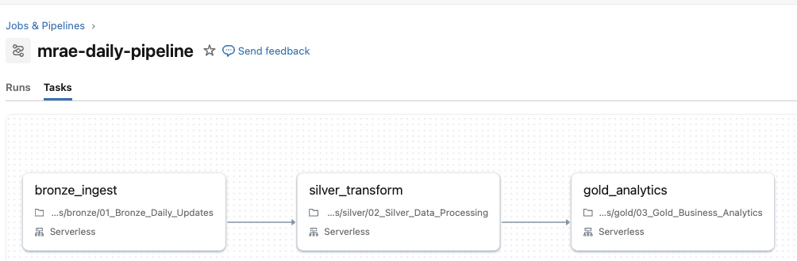
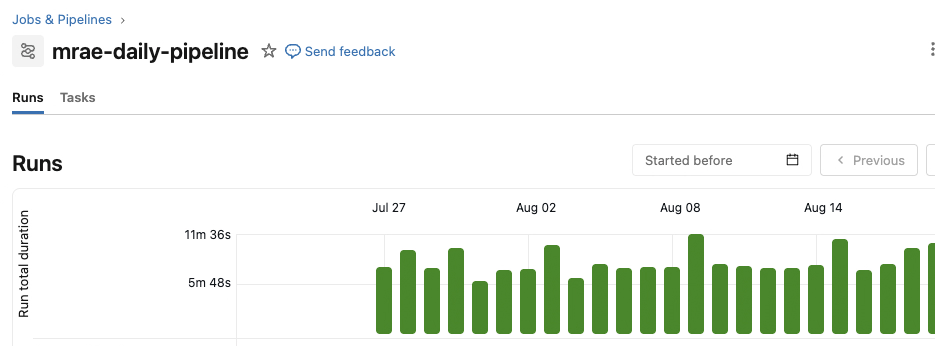

# Market Risk Analytics Engine

A medallion-architecture data pipeline on Databricks that ingests 53 years of daily market data for a 15-stock AI portfolio and produces portfolio risk analytics: Value at Risk, stress-period performance, rolling volatility, drawdown, correlation structure, and market sensitivity.

Built as a data engineering project. Bronze, Silver, and Gold layers are implemented and populated, and daily ingestion runs as a scheduled job. Not investment advice.



---

## Pipeline

```
Alpha Vantage (daily increments)    yfinance (historical backfill)
              \                         /
               v                       v
   Bronze   bronze_market_data_persistent          Delta, immutable, append-only
               |                                   99,499 rows, 15 tickers, 1972-2025
               v
   Silver   silver_daily_prices_enhanced_persistent   typed schema, quality gate,
               |                                      daily returns, moving averages
               v
   Gold     12 analytics tables + dashboard views      VaR, stress, drawdown,
                                                       correlation, beta, tiers
```

Each layer writes a persistent table, so any notebook can be re-run independently without re-running the one before it.

Historical backfill was a one-time load. Ongoing updates run as a scheduled Databricks job, `mrae-daily-pipeline`, which fires once per day after US market close on serverless compute and chains the three layers as dependent tasks. Each task runs only if the previous one succeeded, concurrent runs are capped at one so a slow run cannot overlap the next day's, and failures send an email alert.



Run history above covers daily Bronze ingestion. The chained Silver and Gold tasks were added later, so runs before that date executed ingestion only.

## Data

| | |
|---|---|
| Tickers | 15, plus BOTZ as the sector benchmark |
| History | 1972 to 2025, 53 years |
| Bronze rows | 99,499 |
| Sources | yfinance for historical backfill, Alpha Vantage for daily increments |
| Storage | Delta Lake on Databricks Free Edition |

**Portfolio tiers** (defined in [`src/config/portfolio.py`](src/config/portfolio.py)):

| Tier | Holdings | Character |
|---|---|---|
| 1 | NVDA, MSFT, GOOGL, AMZN, META, AAPL | Mega-cap incumbents |
| 2 | AMD, CRM, ORCL | Established challengers |
| 3 | PLTR, AI, SNOW, MDB, SMCI | High-beta growth |
| Benchmark | BOTZ | AI/robotics sector ETF |

Tiering is what makes the Gold layer interesting: most risk metrics are computed both per ticker and per tier, so concentration and diversification effects are visible rather than averaged away.

## Gold layer analytics

| Table | What it answers |
|---|---|
| `gold_var_analysis` | 1, 5, and 22-day Value at Risk at 95% and 99% confidence |
| `gold_stress_testing` | Performance across four defined stress windows: Financial Crisis 2008-09, COVID Crash 2020, Tech Selloff 2022, 2025 Tariff Uncertainty |
| `gold_drawdown_analysis` | Peak-to-trough loss and recovery duration per ticker |
| `gold_rolling_metrics` | 30, 60, and 90-day rolling volatility and correlation trends |
| `gold_correlation_analysis` | Correlation matrix within and between tiers |
| `gold_market_sensitivity` | Beta against SPY, QQQ, and BOTZ |
| `gold_monthly_analysis` | Month-over-month returns, realized monthly VaR, recent 5-year versus all-time volatility |
| `gold_tier_performance` | Return and risk aggregated by tier |
| `gold_tier_risk_profiles` | Full risk profile and investment character per tier |
| `gold_tier_diversification` | Diversification benefit of the tier split |
| `gold_tier_sensitivity_summary` | Tier-level market sensitivity |
| `gold_portfolio_summary` | Executive rollup |

VaR here is historical simulation, computed from the empirical return distribution via percentiles. It is not parametric and not Monte Carlo, which matters because a 53-year window includes regimes the portfolio's current composition never traded through.

## Design decisions

**Historical backfill is grouped by IPO era, not by ticker.** AMD has data from 1972; PLTR from 2020. Requesting a uniform 1972-2025 range for all 15 tickers wastes most of a free-tier API budget on windows that do not exist. The backfill runs five groups (1972, 1980, 1997, 2007, 2020) sized to each cohort's actual trading history.

**Ingestion is idempotent.** Both the chunked backfill and the daily job check for existing rows before writing, so a re-run after a failure does not duplicate data. In an append-only Bronze layer this is the difference between a restartable pipeline and a corrupted one.

**Two sources, split by role.** yfinance is used for bulk historical backfill where volume matters and rate limits bite. Alpha Vantage handles daily increments where freshness matters. Bronze records which source produced each row.

**Quality is validated before transformation, not after.** The Silver notebook runs a validation pass against Bronze before it transforms anything, so bad rows are caught at the boundary rather than propagating into Gold aggregates that are expensive to recompute.

## Repository layout

```
notebooks/          Databricks implementation (canonical)
  config/           portfolio definition and API configuration
  bronze/           ingestion: initial load, IPO-era chunked backfill, daily increments
  silver/           quality validation and typed transformation
  gold/             14 analysis cells producing the tables above
src/                standalone Python implementation
  config/           portfolio tiers and API config
  data/             bronze, silver, gold layer classes
```

**Two implementations exist and they are not the same system.** `notebooks/` is the canonical one: PySpark and Delta Lake on Databricks, running against the full 53-year dataset. `src/` is an earlier standalone version using pandas, yfinance, and CSV files on local disk. It is kept because it is a readable, dependency-light expression of the same medallion logic, but it is not what produced the numbers above.

## Running it

### Databricks

1. Import `notebooks/` into a workspace.
2. Create a secret scope and add your Alpha Vantage key:
   ```
   databricks secrets create-scope market-risk
   databricks secrets put-secret market-risk alpha_vantage
   ```
3. Run in order: `config/00` → `bronze/01_Bronze_Data_Ingestion` → `bronze/01_Bronze_Historical_Chunks` → `silver/02` → `gold/03`.
4. Schedule `bronze/01_Bronze_Daily_Updates` as a daily job.

Notebooks read the key with `dbutils.secrets.get(scope="market-risk", key="alpha_vantage")`. Never hardcode it. A key committed to a public notebook is scraped within hours.

### Local

```bash
export ALPHA_VANTAGE_API_KEY=your_key
python -m src.data.market_data_extractor
```

`src/data/market_data_extractor.py` reads the key from the environment. Requires `pandas`, `yfinance`, and `requests`.

## Known gaps

- No `requirements.txt` or pinned dependency set.
- No automated tests. Data quality checks are inline in the Silver notebook rather than in a test suite.
- The `src/` implementation has drifted from the notebooks and is not kept in sync.
- Dashboard views are defined in Gold but the dashboard itself lives in Databricks and is not exported here.
- Compute is serverless throughout. No classic job clusters, so cluster sizing and tuning are not part of this project.
- Ingestion is scheduled with a Databricks job rather than expressed as a declarative pipeline.

## A note on credentials

Earlier commits in this repository contained a hardcoded Alpha Vantage API key. Current code reads the credential from a Databricks secret scope, and the exposed keys were replaced and are no longer used by anything.

The git history was deliberately not rewritten. Alpha Vantage does not offer key revocation on its free tier, so purging the commits would not invalidate the old keys, and rewriting published history across branches is a worse trade than leaving a superseded, rate-limited, billing-free key in an old commit. The change that matters is that no current code path reads a credential from source.

## License

MIT. See [LICENSE](LICENSE).
